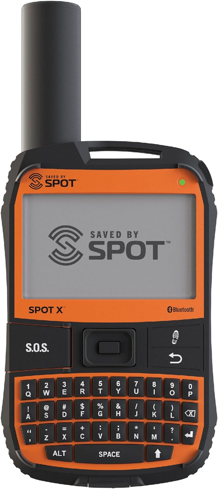

## Voice of the Customer Benchmarking

### Search 

**Keywords:** "off grid communication"

**Search Results Link:** [https://www.amazon.com/s?k=off+grid+communication&crid=1YKFGHC1HEDIK&sprefix=%2Caps%2C145&ref=nb_sb_ss_recent_1_0_recent ](https://www.amazon.com/s?k=off+grid+communication&crid=1YKFGHC1HEDIK&sprefix=%2Caps%2C145&ref=nb_sb_ss_recent_1_0_recent )

### Selected Products

#### 1. [Spot X with Bluetooth 2-Way Satellite Messenger](https://www.amazon.com/Spot-Bluetooth-2-Way-Satellite-Messenger/dp/B07DYC1PGR) 

* Price: $249.95

* Vendor: Amazon

* Description: A handheld device that lets you send and receive messages, share your GPS location, and contact emergency services via satellite when you’re outside cellular coverage.

##### Positive Comments

| Voice of the Customer | Restated Customer Need |
| ------------------------------------------------------------------------- | ------------------------------------------------------------------------- |
| When outside of a typical cellular network range, it sends and receives messages perfectly. | Reliable communication in areas without cellular coverage (explicit) |
| | Confidence that messages will be delivered during emergencies (latent) |
| | Consistent communication performance in remote environments (latent) |
| It sends "tracks" to those requesting updates, making it great for people who want to check in and verify the safety of the user. | Simple location tracking that keeps others informed (explicit) |
| | Peace of mind for family and friends during outdoor activities (latent) |
| | A convenient way to communicate safety without constant manual updates (latent) |
| Connects well to the phone via Bluetooth, making it easy to check and receive messages via satellite. | Quick and reliable Bluetooth pairing with a smartphone (explicit) |
| | Seamless integration between the satellite communicator and mobile devices (latent) |
| | Easy access to messages without a complicated setup process (latent) |                             |

##### Negative Comments

| Voice of the Customer | Restated Customer Need |
| ------------------------------------------------------------------------- | ------------------------------------------------------------------------- |
| The buttons are small and can be finicky to press. | Buttons that are large enough to operate accurately (explicit) |
| | Controls that can be used easily while wearing gloves or in poor weather (latent) |
| | A physical interface that minimizes accidental button presses (latent) |
| There are a lot of menus that pop up on the small screen, making it hard to navigate. | A simple interface with minimal menu navigation (explicit) |
| | Quick access to frequently used features (latent) |
| | An interface that reduces cognitive effort during stressful situations (latent) |
| It can be hard to tell if a message has been successfully sent or not. | Clear confirmation that messages have been sent successfully (explicit) |
| | Immediate feedback on message delivery status (latent) |
| | Confidence that critical communications have reached their intended recipient (latent) |

#### 2. [Tinkering Labs Robotics Engineering Kit](https://www.amazon.com/Tinkering-Labs-Electric-Engineering-Experiments/dp/B01M5GJFQ1/) < (link to the product)

**(include a picture)**

* Price: $65

* Vendor: Amazon

* Description: The kit includes over 50 high quality components and 10 Challenges that inspire kids to invent their own creations. The pieces are a combination of the everyday and the mysterious, perfect for generating creativity, boosting IQ and instilling STEM knowledge.

##### Positive Comments

| Voice of the Customer                                                                                                                                                                  | Restated Customer Need                                                              |
| -------------------------------------------------------------------------------------------------------------------------------------------------------------------------------------- | ----------------------------------------------------------------------------------- |
| "My son just turned 6 and he loves this due to the real tools, real wiring and building to truly make something. It is too advanced for his age to do alone but he will grow into it." | 1.  The kit is perceived as more than a toy (explicit)                              |
|                                                                                                                                                                                        | 2.  The kit can be used by younger children without parental supervision (explicit) |
|                                                                                                                                                                                        | 3.  The kit is safe for children of all ages (latent)                               |

##### Negative Comments

| Voice of the Customer                                                                                                                                                                                                                                                                                                                                                                                | Restated Customer Need                                  |
| ---------------------------------------------------------------------------------------------------------------------------------------------------------------------------------------------------------------------------------------------------------------------------------------------------------------------------------------------------------------------------------------------------- | ------------------------------------------------------- |
| "I am a STEM teacher and bought a large quantity of these kits and I am disgusted by how easily the motor breaks. 12 years in STEM schools and this product is at the bottom of my list. The ladybug platform, as we call it, needs some reimagining and the materials simply can't handle the wear and tear of a classroom. Sad that I spend my own money on this with so little we got out of it." | 1.  The kit is robust. (explicit)                       |
|                                                                                                                                                                                                                                                                                                                                                                                                      | 2.  The moving parts of the kit are reinforced.(latent) |
|                                                                                                                                                                                                                                                                                                                                                                                                      | 3.  The kit survives multiple uses (explicit)           |

### Selected Products

#### 1. [Tinkering Labs Robotics Engineering Kit](https://www.amazon.com/Tinkering-Labs-Electric-Engineering-Experiments/dp/B01M5GJFQ1/) < (link to the product)

**(include a picture)**

* Price: $65

* Vendor: Amazon

* Description: The kit includes over 50 high quality components and 10 Challenges that inspire kids to invent their own creations. The pieces are a combination of the everyday and the mysterious, perfect for generating creativity, boosting IQ and instilling STEM knowledge.

##### Positive Comments

| Voice of the Customer                                                                                                                                                                  | Restated Customer Need                                                              |
| -------------------------------------------------------------------------------------------------------------------------------------------------------------------------------------- | ----------------------------------------------------------------------------------- |
| "My son just turned 6 and he loves this due to the real tools, real wiring and building to truly make something. It is too advanced for his age to do alone but he will grow into it." | 1.  The kit is perceived as more than a toy (explicit)                              |
|                                                                                                                                                                                        | 2.  The kit can be used by younger children without parental supervision (explicit) |
|                                                                                                                                                                                        | 3.  The kit is safe for children of all ages (latent)                               |

##### Negative Comments

| Voice of the Customer                                                                                                                                                                                                                                                                                                                                                                                | Restated Customer Need                                  |
| ---------------------------------------------------------------------------------------------------------------------------------------------------------------------------------------------------------------------------------------------------------------------------------------------------------------------------------------------------------------------------------------------------- | ------------------------------------------------------- |
| "I am a STEM teacher and bought a large quantity of these kits and I am disgusted by how easily the motor breaks. 12 years in STEM schools and this product is at the bottom of my list. The ladybug platform, as we call it, needs some reimagining and the materials simply can't handle the wear and tear of a classroom. Sad that I spend my own money on this with so little we got out of it." | 1.  The kit is robust. (explicit)                       |
|                                                                                                                                                                                                                                                                                                                                                                                                      | 2.  The moving parts of the kit are reinforced.(latent) |
|                                                                                                                                                                                                                                                                                                                                                                                                      | 3.  The kit survives multiple uses (explicit)           |

#### 4. Next Product goes here

#### 5. Next Product goes here

## Organized Need Statements

### First Placement

### Grouped with categories

### Ranked

## Compiled list of user Needs

1. The device will...
1. The device is ...
1. The device can ...
100. The device is...